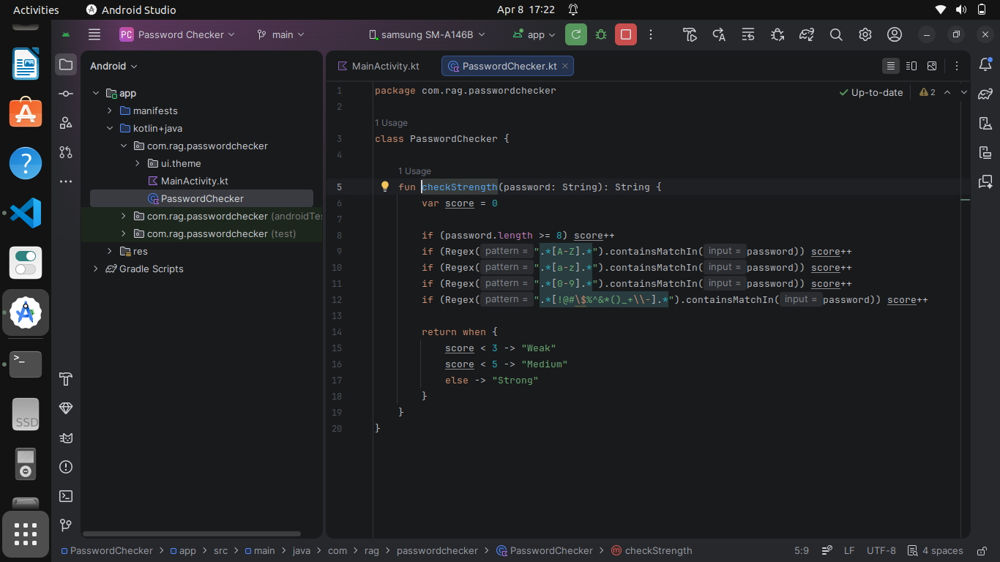
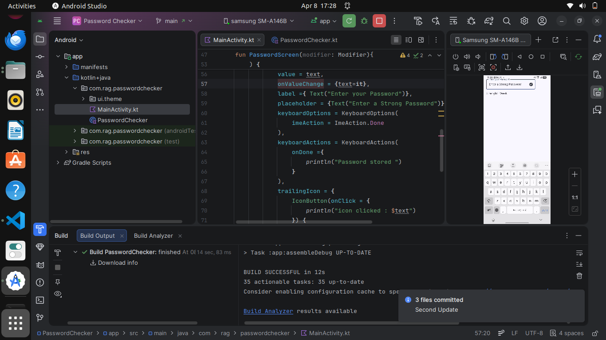

# 🔐 Password Checker App (Android - Kotlin + Jetpack Compose)

A simple and beginner-friendly Android app that checks the **strength of a password in real-time** using Kotlin and Jetpack Compose.

---

## 🚀 Features

* ✅ Real-time password strength checking
* ✅ Detects:

  * Uppercase letters
  * Lowercase letters
  * Numbers
  * Special characters
  * Minimum length
* ✅ Displays strength as:

  * Weak
  * Medium
  * Strong
* ✅ Keyboard "Done" action handling
* ✅ Submit icon inside text field

---

## 🛠️ Tech Stack

* **Language:** Kotlin
* **UI:** Jetpack Compose
* **Architecture:** Simple state-based UI
* **IDE:** Android Studio

---

## 📱 Screenshots

### 🔹 Password Input Screen



### 🔹 Strength Result Screen



> 📌 Place your screenshots inside a folder named `screenshots` in your project root.

---

## 📂 Project Structure

```
com.rag.passwordchecker
│
├── MainActivity.kt       # Entry point
├── PasswordChecker.kt   # Password strength logic
└── ui.theme             # App theme files
```

---

## 🧠 How It Works

The app calculates a **score** based on password rules:

| Rule               | Condition |
| ------------------ | --------- |
| Length             | ≥ 8       |
| Uppercase          | A-Z       |
| Lowercase          | a-z       |
| Numbers            | 0-9       |
| Special Characters | !@#$...   |

### Strength Logic:

* Score < 3 → Weak
* Score < 5 → Medium
* Score = 5 → Strong

---

## ▶️ How to Run

1. Clone the repository
2. Open in Android Studio
3. Run on emulator or real device

---

## 💡 Future Improvements

* 🔥 Password strength progress bar
* 👁 Password visibility toggle
* 🎨 Color-based strength indicator
* 📊 Rule checklist UI
* 🌐 Password breach API integration

---

## 🙌 Author

**Raghupathy.M**

---

## ⭐ Support

If you like this project:

* Give it a ⭐ on GitHub
* Share it on LinkedIn 🚀

---
